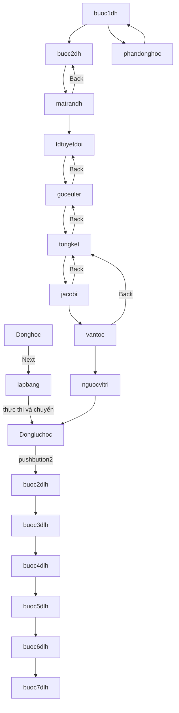

# Giới thiệu

Mã nguồn của dự án được chia sẻ bởi Tiến Sĩ Bùi Thanh Luân, Bộ môn Cơ điện tử - Khoa Cơ Khí, Đại học Bách Khoa TP HCM.
Luôn biết ơn và kính trọng Thầy, cảm ơn những kinh nghiệm quý báu Thầy đã chia sẻ cho Học viên. Mong mọi điều tốt đẹp.

# Kiến trúc GUI MATLAB cho Động học/Động lực học Robot

## 1) Tổng quan kiến trúc

Project được xây theo **MATLAB GUIDE** (mỗi màn hình gồm cặp `.fig` + `.m`).

- `.fig`: bố cục giao diện.
- `.m`: callback, xử lý dữ liệu, điều hướng màn hình.
- Cơ chế khởi tạo chuẩn GUIDE: `gui_mainfcn`, `*_OpeningFcn`, `*_OutputFcn`.
- Truyền dữ liệu giữa màn hình chủ yếu bằng **biến `global`**.

Kiến trúc thực tế gồm 2 nhánh nghiệp vụ chính:

1. **Nhánh động học** (DH, ma trận biến đổi, Euler, Jacobian, vận tốc, nghịch kinematics).
2. **Nhánh động lực học** (`buoc2dlh` → `buoc7dlh` và `Dongluchoc`).

Ngoài ra có các màn hình phụ trợ (`phandonghoc`, `luanvan`) và các hàm tiện ích lượng giác theo độ (`c`, `s`, `t`).

---

## 2) Cấu trúc file và vai trò

## 2.1. Cặp file giao diện

Mỗi GUI có cặp file:

- `Donghoc.fig` ↔ `Donghoc.m`
- `Dongluchoc.fig` ↔ `Dongluchoc.m`
- `buoc1dh.fig` ↔ `buoc1dh.m`
- `buoc2dh.fig` ↔ `buoc2dh.m`
- `matrandh.fig` ↔ `matrandh.m`
- `tdtuyetdoi.fig` ↔ `tdtuyetdoi.m`
- `goceuler.fig` ↔ `goceuler.m`
- `tongket.fig` ↔ `tongket.m`
- `jacobi.fig` ↔ `jacobi.m`
- `vantoc.fig` ↔ `vantoc.m`
- `nguocvitri.fig` ↔ `nguocvitri.m`
- `lapbang.fig` ↔ `lapbang.m`
- `lapbangdlh.fig` ↔ `lapbangdlh.m`
- `buoc2dlh.fig` ↔ `buoc2dlh.m`
- `buoc3dlh.fig` ↔ `buoc3dlh.m`
- `buoc4dlh.fig` ↔ `buoc4dlh.m`
- `buoc5dlh.fig` ↔ `buoc5dlh.m`
- `buoc6dlh.fig` ↔ `buoc6dlh.m`
- `buoc7dlh.fig` ↔ `buoc7dlh.m`
- `vecocau.fig` ↔ `vecocau.m`
- `phandonghoc.fig` ↔ `phandonghoc.m`
- `luanvan.fig` ↔ `luanvan.m`

File backup: `buoc1dh.asv`, `phandonghoc.asv`.

## 2.2. Hàm tiện ích

- `c.m`: `cos` theo đơn vị độ.
- `s.m`: `sin` theo đơn vị độ.
- `t.m`: `tan` theo đơn vị độ.

Các hàm này được dùng rộng rãi trong tính toán ma trận robot.

---

## 3) Entry point và điều hướng tổng thể

## 3.1. Entry point khả dĩ

Trong code hiện tại, các điểm bắt đầu thường thấy:

- `Donghoc` (màn hình nhập/cấu hình cho nhánh động học).
- `phandonghoc` (màn hình mô tả bài toán, có thể quay về `buoc1dh`).

> Ghi chú: dự án không có script launcher duy nhất rõ ràng; người dùng thường gọi trực tiếp tên GUI trong MATLAB Command Window.

## 3.2. Sơ đồ luồng chính

---

## 4) Liên kết callback giữa các file (ai gọi ai)

Dưới đây là các liên kết điều hướng **xác nhận trực tiếp trong callback**:

- `Donghoc.Next_Callback`:
  - `close(Donghoc); lapbang;`

- `lapbang`:
  - nhánh chuyển xử lý: `close(lapbang); dongluchoc;`
  - có callback khác gọi `auto; close(lapbang);`

- `Dongluchoc.back_Callback`:
  - `close(dongluchoc); lapbang;`
- `Dongluchoc.pushbutton2_Callback`:
  - `close(Dongluchoc); buoc2dlh;`

### 4.1. Nhánh động học thuận/vi phân

- `buoc1dh.pushbutton9_Callback`:
  - `close(buoc1dh); buoc2dh;`
- `buoc1dh.pushbutton10_Callback`:
  - `close(buoc1dh); phandonghoc;`

- `phandonghoc.Next_Callback`:
  - `close(phandonghoc); buoc1dh;`

- `buoc2dh.next_Callback`:
  - `close(buoc2dh); matrandh;`
- `buoc2dh.pushbutton3_Callback`:
  - `close(buoc2dh); buoc1dh;`

- `matrandh.next_Callback`:
  - `close(matrandh); tdtuyetdoi;`
- `matrandh.back_Callback`:
  - `close(matrandh); buoc2dh;`

- `tdtuyetdoi.next_Callback`:
  - `close(tdtuyetdoi); goceuler;`
- `tdtuyetdoi.back_Callback`:
  - `tdtuyetdoi; close(tdtuyetdoi);` (hành vi quay lại bất thường, dễ lặp)

- `goceuler.next_Callback`:
  - `close(goceuler); tongket;`
- `goceuler.back_Callback`:
  - `tdtuyetdoi; close(goceuler);`

- `tongket.next_Callback`:
  - `close(tongket); jacobi;`
- `tongket.back_Callback`:
  - `close(tongket); goceuler;`

- `jacobi.next_Callback`:
  - `close(jacobi); vantoc;`
- `jacobi.back_Callback`:
  - `close(jacobi); tongket;`

- `vantoc.next_Callback`:
  - `close(vantoc); nguocvitri;`
- `vantoc.back_Callback`:
  - `close(vantoc); tongket;`

- `nguocvitri.tieptuc_Callback`:
  - `close(nguocvitri); dongluchoc;`

### 4.2. Nhánh động lực học theo bước

- `buoc2dlh.pushbutton2_Callback`:
  - `close(buoc2dlh); buoc3dlh;`
- `buoc2dlh.pushbutton3_Callback`:
  - `close(buoc2dlh); dongluchoc;`
- `buoc2dlh.pushbutton4_Callback`:
  - `close(buoc2dlh); buoc3dlh;`

- `buoc3dlh.back_Callback`:
  - `close(buoc3dlh); buoc2dlh;`
- `buoc3dlh.next_Callback`:
  - `close(buoc3dlh); buoc4dlh;`

- `buoc4dlh.next_Callback`:
  - `close(buoc4dlh); buoc5dlh;`
- `buoc4dlh.back_Callback`:
  - `close(buoc4dlh); buoc3dlh;`

- `buoc5dlh.back_Callback`:
  - `close(buoc5dlh); buoc4dlh;`
- `buoc5dlh.next_Callback`:
  - `close(buoc5dlh); buoc6dlh;`

- `buoc6dlh.back_Callback`:
  - `close(buoc6dlh); buoc5dlh;`
- `buoc6dlh.next_Callback`:
  - `close(buoc6dlh); buoc7dlh;`

- `buoc7dlh.back_Callback` và `buoc7dlh.next_Callback` hiện để trống (chưa điều hướng).

---

## 5) Kiến trúc dữ liệu và phụ thuộc tính toán

## 5.1. Mô hình truyền dữ liệu

Dự án dùng **shared-state qua `global`** thay vì truyền tham số hàm.

Mẫu điển hình:

1. GUI trước ghi `global` từ edit box.
2. GUI sau đọc `global` để tính và hiển thị.
3. Các callback `next/back` chủ yếu đóng form hiện tại rồi mở form kế.

## 5.2. Nhóm biến `global` chính

### A) Cấu hình robot & DH

- `n`: số khâu/khớp.
- `loaikhop` / `loai`: loại khớp (R/P).
- `phi`, `alpha`, `a`, `d`: tham số DH.

Được dùng nhiều ở: `buoc1dh`, `buoc2dh`, `matrandh`, `lapbang`, `nguocvitri`, `Dongluchoc`.

### B) Ma trận biến đổi

- `A`, `D`, `T`: ma trận biến đổi theo từng khâu/hệ quy chiếu.
- `Aq`: ma trận hiển thị trong nhánh động lực học.

Được dùng ở: `matrandh`, `tongket`, `jacobi`, `vantoc`, `buoc2dlh`, `buoc3dlh`.

### C) Biến động lực học

- `U`, `M`, `trunggian`: ma trận trung gian và ma trận khối lượng.
- `m`: thông số khối lượng.
- `V`, `Vp`, `Sv`, `G`: các đại lượng vận tốc/gia tốc/lực theo bước.

Được dùng ở: `buoc3dlh` → `buoc7dlh`.

### D) Kết quả phụ trợ

- `g1`, `g2`, `g3`: góc Euler cho từng khâu.
- `vantockhau`, `giatockhau`: vận tốc/gia tốc khớp nhập từ GUI.
- `soi`, `soj`: chỉ số hiển thị phần tử ma trận trong `buoc4dlh`.

---

## 6) Vai trò chi tiết theo nhóm chức năng

## 6.1. Nhóm động học

- `buoc1dh.m`: chọn kiểu khớp từng khâu, bật/tắt control nhập theo R/P.
- `buoc2dh.m`: nhập DH theo số khâu và gom dữ liệu vào `phi/alpha/a/d/loai`.
- `matrandh.m`: hiển thị ma trận A/T theo dữ liệu DH.
- `tdtuyetdoi.m`: màn hình ma trận tuyệt đối.
- `goceuler.m`: tính/hiển thị góc Euler từ `T`.
- `tongket.m`: tổng hợp kết quả và cho phép xem theo từng khâu.
- `jacobi.m`: tính Jacobian và thu vận tốc khớp.
- `vantoc.m`: tính vận tốc đầu công tác.
- `nguocvitri.m`: phần nghịch động học, sau đó nối sang động lực học.

## 6.2. Nhóm động lực học

- `Dongluchoc.m`: cửa ngõ nhánh động lực học và hiển thị kết quả.
- `buoc2dlh.m`: chuẩn bị ma trận cho nhánh động lực học.
- `buoc3dlh.m`: tính các ma trận trung gian (`U`, `M`, ...).
- `buoc4dlh.m`: tra cứu/hiển thị phần tử ma trận trung gian.
- `buoc5dlh.m`: tính thành phần liên quan vận tốc/gia tốc.
- `buoc6dlh.m`: hiển thị thêm thành phần lực/tải (qua biến `G`).
- `buoc7dlh.m`: nhập vận tốc/gia tốc và hiển thị kết quả cuối.

## 6.3. Nhóm phụ trợ

- `Donghoc.m`: màn hình nhập nhanh số khâu và điều hướng qua `lapbang`.
- `lapbang.m`: form trung gian trước khi vào `Dongluchoc`.
- `lapbangdlh.m`: màn hình vẽ/hiển thị phụ cho nhánh động lực học.
- `phandonghoc.m`: màn hình diễn giải bài toán.
- `vecocau.m`: màn hình vẽ cơ cấu/vector (khá độc lập).
- `luanvan.m`: GUI riêng (thiên về mô phỏng điều khiển, dùng tập global khác).

---

## 7) Mối liên kết logic giữa các cụm file

1. **Cụm thiết lập mô hình robot**: `buoc1dh` + `buoc2dh`
   - tạo bộ tham số DH chuẩn.
2. **Cụm biến đổi hình học**: `matrandh` + `tdtuyetdoi` + `goceuler` + `tongket`
   - biến đổi và diễn giải tư thế robot.
3. **Cụm vi phân động học**: `jacobi` + `vantoc`
   - từ Jacobian sang vận tốc đầu cuối.
4. **Cụm nối sang động lực học**: `nguocvitri` → `Dongluchoc`.
5. **Cụm động lực học nhiều bước**: `buoc2dlh` → `buoc7dlh`.

=> Tổng thể là pipeline tính toán nối tiếp, liên kết bằng callback điều hướng và `global` state.

---
